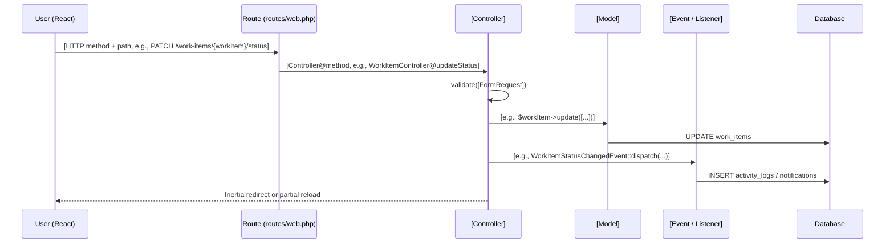
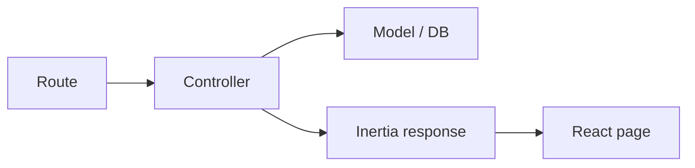

# [Feature Name] — Feature Design

> **Status:** [Draft | Proposed | Accepted | Implemented]
> **Owner:** [Your name or team]
> **Date:** YYYY-MM-DD
> **Last Updated:** YYYY-MM-DD
> **Related docs:** [link to other docs], [ADR-XXX]
>
> **Template instructions:** Copy this file to the relevant folder under `docs/` (e.g., `docs/04-frontend/kanban-board.md`), fill in each section, and delete the instructional lines.

---

## 1. Overview

One paragraph: what this feature does and why it exists.

What problem does it solve? Who is it for?

> - Write 1–3 sentences.
> - Example: "The kanban board lets project members visualize and update work item statuses via drag-and-drop, without leaving the project page."

### Scope

| In scope | Out of scope |
|---|---|
| [e.g., Drag-and-drop between columns] | [e.g., Reordering work items within a column] |
| [e.g., Status persistence via PATCH] | [e.g., Collaborative live cursors] |
| [e.g., Optimistic UI updates] | [e.g., Mobile touch gestures] |

---

## 2. Data Flow

A sequence diagram tracing the request lifecycle end-to-end.



> - Replace bracketed placeholders with real route, controller, model, event names.
> - If there's no event/notification, delete that participant.
> - For simple CRUD, a `flowchart` may be enough:



---

## 3. Route Mapping

| Method | URI | Controller@method | Route name | Notes |
|---|---|---|---|---|
| GET | `/projects/{project}/kanban` | `ProjectsController@kanban` | `projects.kanban` | |
| PATCH | `/work-items/{workItem}/status` | `WorkItemController@updateStatus` | `work-items.status.update` | Body: `{ status_id }` |
| | | | | |

> - Run `php artisan route:list` to get exact routes.

---

## 4. Key Files

| File | Responsibility |
|---|---|
| `app/Http/Controllers/[X]Controller.php` | Handles request validation, business logic, Inertia response |
| `app/Models/[X].php` | Eloquent model, relationships, casts, traits |
| `app/Events/[X].php` | Fired on action; listened to for side effects |
| `app/Listeners/[X].php` | Handles event, dispatches notifications, logs activity |
| `app/Http/Requests/[X]Request.php` | Form request validation rules |
| `database/migrations/..._create_[x]_table.php` | Table schema |
| `resources/js/pages/[x].tsx` | React page component |
| `resources/js/components/[x].tsx` | Shared/reusable React component |

> - Only include rows that actually exist for this feature. Delete the rest.

---

## 5. Key Code

The 5–15 most important lines for understanding this feature.

```php
// app/Http/Controllers/WorkItemController.php
public function updateStatus(WorkItem $workItem, Request $request)
{
    $workItem->update(['status_id' => $request->status_id]);

    WorkItemStatusChangedEvent::dispatch($workItem, auth()->user());

    return back();
}
```

> - Prefer real code from the repository over pseudo-code.
> - Include the file path as a comment above the snippet.

---

## 6. State / Data Model

### New or changed columns

| Table | Column | Type | Notes |
|---|---|---|---|
| `work_items` | `status_id` | bigint FK → `work_item_statuses` | Current status |
| `work_items` | `group_id` | bigint FK → `work_item_groups` | Nullable |

### Relationships

| Model | Relationship | Related model | FK |
|---|---|---|---|
| `work_item` | `belongsTo` | `work_item_statuses` | `status_id` |
| `work_item` | `belongsTo` | `work_item_groups` | `group_id` |

> - Only include if this feature adds or changes schema.

---

## 7. Frontend Details

### Page / component structure

```
resources/js/pages/projects/show.tsx
└── <KanbanBoard>
    ├── <KanbanColumn>  × N        (one per group)
    │   └── <WorkItemCard>  × M
    └── <AddWorkItemButton>
```

### State management

| State | Where | How it's stored |
|---|---|---|
| Drag preview | `KanbanBoard` | React `useState` |
| Column list | `KanbanBoard` | Inertia prop from server |
| Work item status | Server | `work_items.status_id` |

### Data fetching

- [ ] Server-rendered via Inertia props
- [ ] Deferred prop (`Inertia::defer()`)
- [ ] Inertia polling (`router.poll()`)
- [ ] Real-time broadcast (Pusher/Echo)
- [ ] Client-side fetch (`useEffect` + `fetch`)

---

## 8. Edge Cases & Trade-offs

### Edge cases

- [e.g., Dragging a work item into an empty column]
- [e.g., Two users reordering the same item simultaneously — last-write-wins]
- [e.g., Network failure during PATCH — how is optimistic state rolled back?]

### Trade-offs

| Choice | Trade-off |
|---|---|
| [e.g., Optimistic updates] | Snappy UX but requires rollback logic |
| [e.g., Polling every 30s] | Simple but up-to-30s stale |

> - If a trade-off is significant enough to be a *decision*, move it to an ADR and link it here.

---

## 9. Testing

| Test file | Covers |
|---|---|
| `tests/Feature/WorkItemStatusTest.php` | Status update validation, authorization, event dispatch |
| `tests/Unit/` | [Model accessors, casts, etc.] |

Run:

```bash
php artisan test --filter=WorkItemStatusTest
```

> - List only tests that exist or that need to be written.

---

## 10. Open Questions / Follow-ups

- [ ] [Question or follow-up]
- [ ] [Question or follow-up]