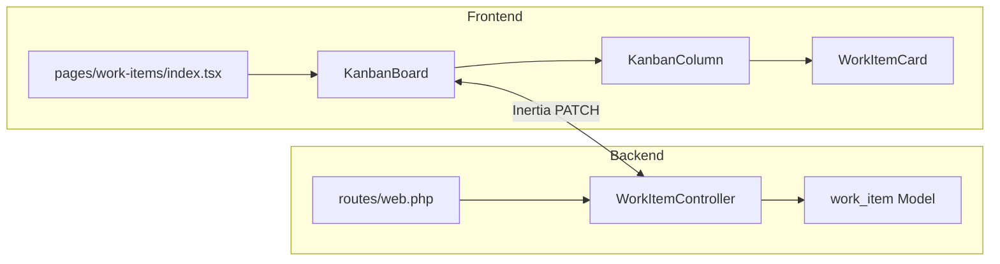

# [Module Name] — Module Reference

> **Status:** [Draft | Proposed | Accepted | Implemented]
> **Owner:** [Your name or team]
> **Date:** YYYY-MM-DD
> **Last Updated:** YYYY-MM-DD
>
> **Template instructions:** Copy this file to the relevant folder (e.g., `docs/04-frontend/kanban-board.md`), fill in each section, and delete the instructional lines. This template is for deep-diving an existing module or feature area — use `feature-design.md` when designing something new.

---

## 1. Purpose

What this module is and the problem it solves.

> - 1–2 sentences.
> - Example: "The Kanban module lets project members visualize work items as cards grouped by status or sprint, and update their status via drag-and-drop."

---

## 2. Architecture Diagram



> - Adjust to match the actual module structure.

---

## 3. Key Files

| File | Responsibility |
|---|---|
| `routes/web.php` | Route definitions for this module |
| `app/Http/Controllers/WorkItemController.php` | Request handling, validation, Inertia responses |
| `app/Models/work_item.php` | Eloquent model, relationships, casts, `LogsActivity` |
| `app/Http/Requests/WorkItemRequest.php` | Validation rules |
| `app/Events/WorkItemStatusChangedEvent.php` | Dispatched on status change |
| `resources/js/pages/work-items/show.tsx` | React page component |
| `resources/js/components/kanban/kanban-board.tsx` | Board container (columns state, DnD) |
| `resources/js/components/kanban/kanban-column.tsx` | Single column; DnD drop target |
| `resources/js/components/kanban/work-item-card.tsx` | Card UI; drag source |

> - Replace with real file paths for the module.

---

## 4. Data Flow

```text
[User action, e.g., drag card to "Done"]
  → [React handler, e.g., onDrop in KanbanColumn]
  → [PATCH /work-items/{id}/status with body { status_id }]
  → [WorkItemController@updateStatus]
    → validate()
    → $workItem->update(['status_id' => ...])
    → dispatch(WorkItemStatusChangedEvent)
      → Listener sends notification + broadcasts via Pusher
    → return back() (Inertia)
  → [React revalidates props → board re-renders]
```

---

## 5. Model & Relationships

### Model: `work_item`

| Relationship | Type | Related | FK |
|---|---|---|---|
| `project()` | `belongsTo` | `projects` | `project_id` |
| `status()` | `belongsTo` | `work_item_statuses` | `status_id` |
| `group()` | `belongsTo` | `work_item_groups` | `group_id` |
| `assignee()` | `belongsTo` | `users` | `assignee_id` |

### Relevant columns

| Table | Column | Type | Notes |
|---|---|---|---|
| `work_items` | `status_id` | bigint FK | Current status |
| `work_items` | `group_id` | bigint FK, nullable | Group/sprint assignment |

---

## 6. Events & Listeners

| Event | Dispatched from | Listener(s) | Side effects |
|---|---|---|---|
| `WorkItemStatusChangedEvent` | `WorkItemController@updateStatus` | `SendStatusChangeNotification` | DB notification + Pusher broadcast |
| | | | |

> - Only include events actually used by this module.

---

## 7. Frontend State Management

| State | Managed by | Mechanism |
|---|---|---|
| Column/group list | `KanbanBoard` | Inertia prop from server |
| Drag preview | `KanbanBoard` | React `useState` |
| Optimistic card position | `KanbanBoard` | Local state, rolled back on error |
| Real-time status updates | Echo listener | Pusher channel per project |

---

## 8. Configuration & Dependencies

| Dependency | Version | Used for |
|---|---|---|
| `@dnd-kit/core` | ^6 | Drag-and-drop |
| `pusher-js` | ^8 | Real-time broadcasts |
| `@inertiajs/react` | ^2 | Server-driven page props |

> - List only packages directly involved in this module.

---

## 9. Edge Cases

- [e.g., Dragging a card into an empty column]
- [e.g., Duplicate/conflicting updates from multiple users]
- [e.g., Optimistic update failure — rollback behavior]
- [e.g., Cards with `group_id = null` (unassigned)]
- [e.g., Long lists — virtualization?]

---

## 10. Testing

| Test file | Covers |
|---|---|
| `tests/Feature/WorkItemStatusTest.php` | Status validation, authorization, event fired |
| `tests/Feature/KanbanTest.php` | [Module-specific behaviors] |

Run:

```bash
php artisan test --filter=WorkItemStatusTest
```

---

## 11. Related Documents

- [Feature Design: Kanban Board](../00-templates/feature-design.md)
- [ADR-XXX: ...](../01-architecture/decisions/ADR-XXX-....md)
- [Database Schema](../01-architecture/database-schema.md)