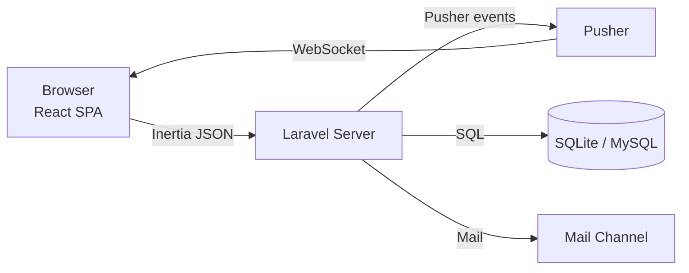
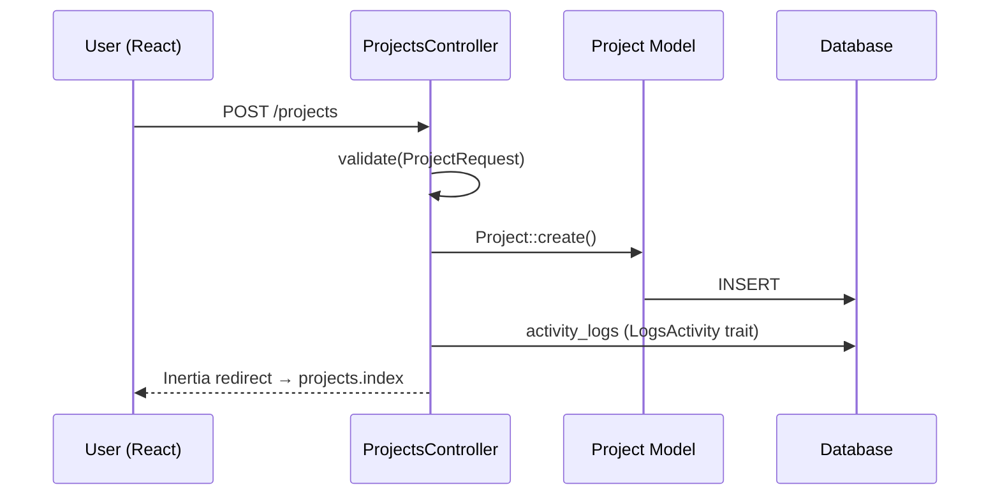
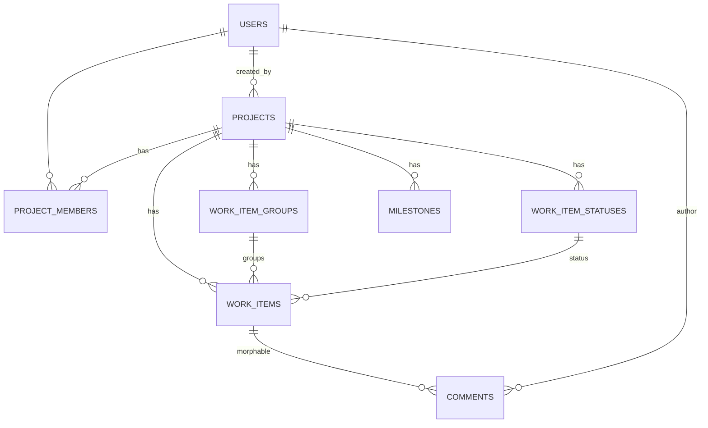

# How to Build Architecture Design Documents

> **Last Updated:** 2026-08-01
>
> This guide explains how to write, structure, and maintain **Architecture Design Documents (ADDs)** for this project. Use the templates in [`docs/00-templates/`](../00-templates/) to get started quickly.

---

## 1. What Is an Architecture Design Document?

An ADD is a **living reference** that explains:

| Question | What it answers |
|---|---|
| **What** | The system's components, layers, and modules |
| **How** | How those pieces interact — data flow, communication, dependencies |
| **Why** | Key technical decisions and the trade-offs that were made |
| **Where** | How to navigate the codebase — a map of routes → controllers → models → React pages |

An ADD is **not** an essay. It is a **reference manual** that lets a reader answer "how does this work?" as quickly as possible.

---

## 2. When to Write an ADD

Write or update a document when:

- **Adding a new feature** — document the feature's data flow, files touched, and key decisions.
- **Making an architectural decision** — record an ADR if you chose one approach over another (e.g., "polling vs. WebSockets").
- **Making a change to existing behavior** — update the affected docs so they never go stale.
- **Onboarding a new developer** — a "How to Read This Codebase" doc is the single highest-value doc you can write.
- **Before a code review / design review** — a written design doc makes the review 10x more productive.

> **Rule of thumb:** If a future developer would ask "why is this done this way?", document it. If they would ask "where is the code that does X?", document it.

---

## 3. Document Structure (The Standard Outline)

Use this outline as a starting point. Every section is optional — include only what is relevant to your document.

### 3.1 Front Matter

```markdown
---
title: Feature Design — Work Item Comments
status: draft | proposed | accepted | implemented | deprecated
owner: <your-name>
date: 2026-08-01
last-updated: 2026-08-01
---

# Work Item Comments — Feature Design
```

### 3.2 Overview (Context)

- **1 paragraph**: what this system/feature does, and why it exists.
- **Tech stack** (if this is a high-level doc): a table like the one in [`docs/README.md`](../README.md).
- **Scope**: what is in scope, and explicitly what is out of scope.

### 3.3 Architecture Diagram

Prefer **Mermaid** (renders natively on GitHub) over ASCII art. Mermaid is also far easier to maintain.

**Context diagram** (system-level):



**Data flow for a feature** (sequence diagram):



> **Legacy ASCII style** (already used in `docs/01-architecture/overview.md`) is acceptable, but prefer Mermaid for new diagrams.

### 3.4 Key Design Patterns

For each meaningful pattern, have a short subsection:

| Pattern | Where it lives in this codebase |
|---|---|
| Inertia.js SPA | Every controller returns `Inertia::render()`; pages in `resources/js/pages/` |
| Event-driven notifications | `app/Events/` → `app/Listeners/` → `app/Notifications/` + Pusher |
| Trait-based activity logging | `LogsActivity` trait on models |
| Role-based authorization | `RolesController`, `PermissionsController`, `model_has_roles` pivot |
| Resourceful controllers | `Route::resource()` in `routes/web.php` |

For each pattern, include:

1. **What it is** (2–3 sentences)
2. **Where it is used** (file/directory pointers)
3. **A minimal code example**
4. **When to use it / when not to use it**

### 3.5 Data Model

For schema-level docs, use the format already established in [`docs/01-architecture/database-schema.md`](../01-architecture/database-schema.md): one table per section with a Markdown table of columns, plus a relationships table.

For **ERDs**, prefer Mermaid:



### 3.6 Component / Module Reference

The highest-value table in any ADD. For each feature area, list:

| File | Responsibility |
|---|---|
| `app/Http/Controllers/WorkItemController.php` | Handles CRUD for work items |
| `app/Models/work_item.php` | Eloquent model, relationships, `LogsActivity` |
| `database/migrations/...create_work_items_table.php` | Schema definition |
| `resources/js/pages/work-items/*.tsx` | React pages for work items |
| `resources/js/components/kanban/kanban-*.tsx` | Kanban board UI |

### 3.7 Data Flow Scenarios

Pick 2–5 **real features** and trace them end-to-end. This is the fastest way for a new developer to understand the system.

Example (from `docs/01-architecture/overview.md`):

```text
User changes status → WorkItemController@updateStatus
  → Updates work_item.status_id
  → Dispatches WorkItemStatusChangedEvent
  → Listener: SendStatusChangeNotification
    → Checks user's notification settings
    → Creates database notification
    → Broadcasts via Pusher channel
  → React UI receives broadcast → updates notification bell
```

### 3.8 Cross-Cutting Concerns

Document the system-wide behaviors once, in one shared section (they apply to many features):

| Concern | Where documented | One-liner |
|---|---|---|
| Authentication | `02-setup/` | Laravel auth guard; Breeze-style |
| Authorization | `03-backend/authorization.md` | Roles/permissions via Spatie-style `model_has_roles` |
| Activity logging | `03-backend/activity-logging.md` | `LogsActivity` trait auto-logs create/update/delete |
| Real-time | `04-frontend/real-time.md` | Pusher + Laravel Echo; polling as fallback |
| Validation | `app/Http/Requests/` | Laravel Form Requests |
| Error handling | Laravel's exception handler | Inertia error props |

### 3.9 Infrastructure & Deployment

- Environments: local (`php artisan serve`), production (`SQLite` vs MySQL note)
- Build: Vite (`npm run build`), asset pipeline
- Deployment: Laravel Cloud / Forge / custom — document the chosen path in `02-setup/deployment.md`

### 3.10 Style Guide / Conventions

Document naming and structural conventions so contributors write consistent code:

| Topic | Convention in this repo |
|---|---|
| PHP classes | PSR-12 + Laravel Pint (`vendor/bin/pint`) |
| Models | Singular lowercase (`work_item`), table names snake-case plural |
| Controllers | Resourceful, returns `Inertia::render()` |
| React components | `resources/js/components/`, shared UI in `components/ui/` |
| TypeScript types | `resources/js/types/` |
| Tests | Pest PHP in `tests/Feature` and `tests/Unit` |
| Routes | Named routes, `Route::resource()` where possible |

### 3.11 ADRs — Architecture Decision Records

When you make a **notable technical decision**, capture it as a small ADR:

```markdown
# ADR-001: Use Polling Instead of WebSockets for the Kanban Board

## Status
Accepted

## Context
The kanban board needed live updates without the complexity of a WebSocket connection.

## Decision
Use Inertia polling (`router.poll()`) every 30 seconds.

## Alternatives considered
- Pusher channel per project (rejected: more moving parts, cost, auth complexity)

## Consequences
+ Simpler to implement and debug
+ No server-side event broadcasting for kanban
− Updates up to 30s late; not truly "real-time"
```

See [`docs/00-templates/adr-template.md`](../00-templates/adr-template.md) for the full template.

---

## 4. How to Build an ADD — Step-by-Step Process

### Step 1 — Create the doc skeleton

Copy the most relevant template from `docs/00-templates/`:

```bash
cp docs/00-templates/feature-design.md docs/04-frontend/kanban-board.md
```

### Step 2 — Gather the facts from the code

Before writing, answer these questions by reading the code:

1. Which **routes** touch this feature? (`php artisan route:list`)
2. Which **controllers** handle it?
3. Which **models** and **table columns** are involved?
4. Which **React pages/components** render it?
5. Which **events/listeners/notifications** fire?
6. What are the **edge cases** the code handles?

### Step 3 — Draw the data flow first

A Mermaid sequence diagram forces you to understand the request lifecycle before you write prose. Do this before any narrative text.

### Step 4 — Write tables before prose

- File-reference tables
- Column tables
- Route tables
- Relationship tables

Only add prose where a table cannot express the idea (e.g., explaining *why* something is done).

### Step 5 — Add a "Key Code" section

Show 5–15 lines of the most important code (a controller method, a trait, a hook). Point readers at the file so they can open it themselves.

### Step 6 — Review against these questions

- [ ] Can a new developer find the code this doc describes in under 2 minutes?
- [ ] Does every section have at least one file path or route?
- [ ] Are decisions explained with their alternatives/trade-offs?
- [ ] Is the doc free of opinions that belong in an ADR instead?
- [ ] Does the doc reflect the *current* code (not aspirational)?

### Step 7 — Update the index

Add a link in [`docs/README.md`](../README.md) to your new document.

---

## 5. Principles for Good ADDs

### 5.1 Documents over prose

Use **tables, code snippets, and diagrams** over paragraphs. Keep every section scannable.

### 5.2 State facts, not opinions

| ❌ Opinion | ✅ Fact |
|---|---|
| "We chose a good auth approach." | "Authentication uses Laravel's built-in auth guard with session-based login." |
| "The code is well organized." | "Controllers live in `app/Http/Controllers/`, pages in `resources/js/pages/`." |

Opinions and rationale belong in **ADRs**, where the decision and its context are recorded.

### 5.3 Show the actual code

Include small, real snippets (a controller line, a route definition, a trait signature) so readers see exactly what things look like in the codebase.

### 5.4 Trace real user journeys

Pick real features and trace them end-to-end. This helps new devs much more than abstract descriptions.

### 5.5 Keep it current — ADDs rot

- Put a **Last Updated** date at the top of each doc.
- Make updating docs part of the **definition of done** when features change.
- Consider a PR template checkbox: `Did you update the associated docs?`

### 5.6 Layer from most-stable to least-stable

Stable concepts first (overview, data model), frequently-changing details later (API endpoints, specific component implementations).

---

## 6. Diagram Types & When to Use Them

| Diagram type | Tool | When to use |
|---|---|---|
| Context diagram | Mermaid `flowchart` | High-level system boundaries (browser, server, DB, external services) |
| Sequence diagram | Mermaid `sequenceDiagram` | Request lifecycle for a single feature |
| ERD | Mermaid `erDiagram` | Tables and relationships |
| Class diagram | PlantUML | Model classes, traits, interfaces (rarely needed in this stack) |
| State diagram | Mermaid `stateDiagram-v2` | Workflow states (e.g., work item statuses) |
| Fishbone / decision tree | Mermaid `flowchart` | Alternative-selection explanations in an ADR |

---

## 7. Directory Layout

```
docs/
├── 00-templates/                          ← copy these to start new docs
│   ├── adr-template.md                    ← Architecture Decision Record
│   ├── feature-design.md                  ← full feature design doc
│   └── module-reference.md                ← component/module deep-dive
├── 01-architecture/
│   ├── overview.md
│   ├── database-schema.md
│   └── decisions/                         ← ADRs (one file per decision)
│       └── ADR-001-inertia-spa.md
├── 02-setup/
│   ├── installation.md
│   └── deployment.md
├── 03-backend/
│   ├── models.md
│   ├── controllers.md
│   ├── events-and-listeners.md
│   ├── notifications.md
│   ├── activity-logging.md
│   └── authorization.md
├── 04-frontend/
│   ├── pages-and-routing.md
│   ├── components.md
│   ├── kanban-board.md
│   ├── gantt-chart.md
│   └── real-time.md
├── 05-api/
│   └── notification-api.md
└── 06-guides/
    ├── architecture-design-documents.md   ← this file
    └── contributing.md
```

---

## 8. Quick Workflow Checklist

When tasked with adding a new feature, use this checklist:

- [ ] **1. Define context** — one paragraph: what problem, what constraint (1–3 sentences)
- [ ] **2. Draw the data flow** — Mermaid sequence diagram: route → controller → model/event → response
- [ ] **3. List changed files** — table: file path / responsibility / what changed
- [ ] **4. Show key code** — 5–15 lines of the most important new logic
- [ ] **5. Note edge cases & trade-offs** — 3–5 bullets max
- [ ] **6. Record the decision (ADR)** if you chose between alternatives
- [ ] **7. Update the README index** — add the new doc link